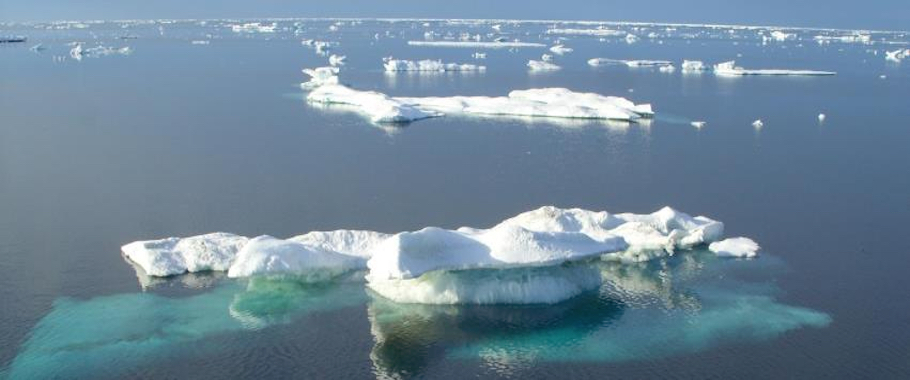
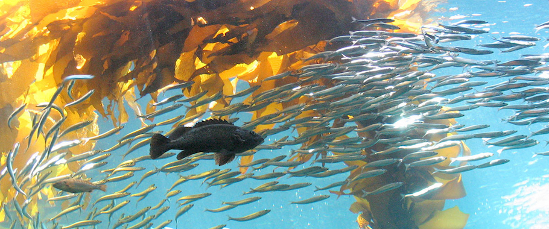
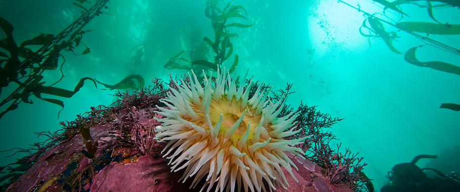

<!-- Indicators -->
<ol class="carousel-indicators">
  <li data-target="#carousel-example-generic" data-slide-to="0" class="active"></li>
  <li data-target="#carousel-example-generic" data-slide-to="1"></li>
  <li data-target="#carousel-example-generic" data-slide-to="2"></li>
</ol>

<!-- Wrapper for slides -->

  

  
  

  <h3>Arctic Ice</h3>
  
Photo credit: Chad King (NOAA)

  

  

  

  
  

  <h3>Pelagic Life in Kelp Forests</h3>
  
Photo credit: Brett Seymour (NPS)

  

  

  

  
  

  <h3>Benthic Life in Kelp Forests</h3>
  
Photo credit: Submerged Resources Center

  

  

<!-- Controls -->
<a class="left carousel-control" href="#carousel-example-generic" role="button" data-slide="prev">
  
  Previous
</a>
<a class="right carousel-control" href="#carousel-example-generic" role="button" data-slide="next">
  
  Next
</a>

